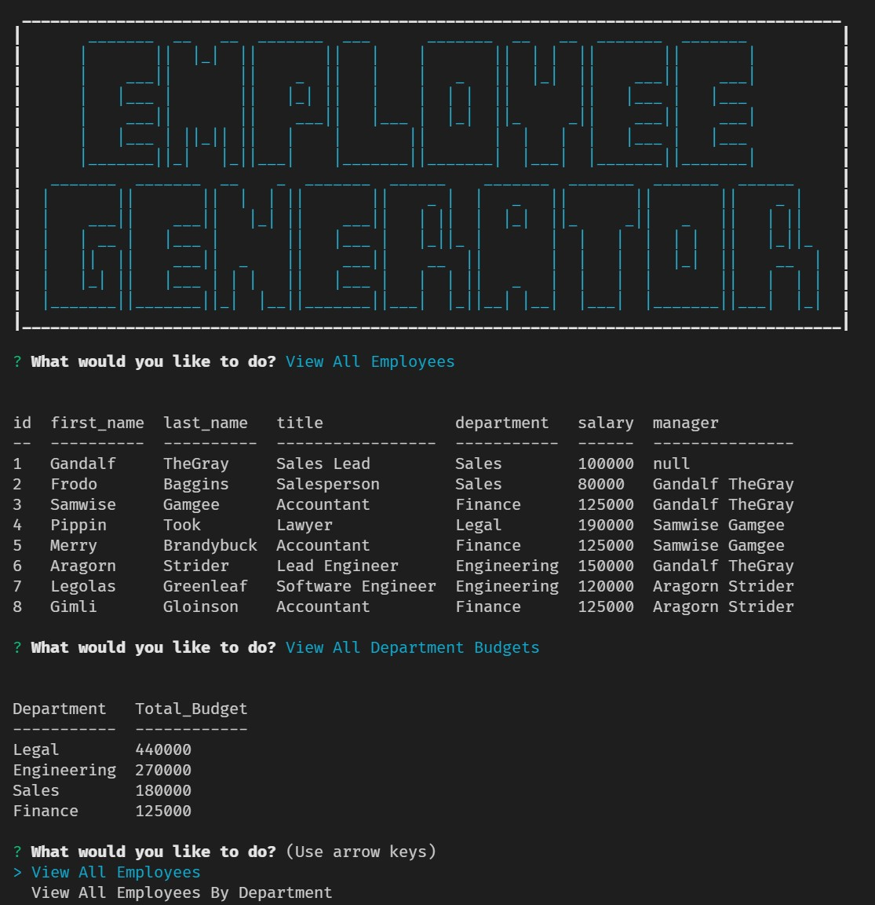

# Employee Tracker
Keep track of those pesky employees, so they don't learn what a work/life balance actually is.

[Live video!](https://drive.google.com/file/d/17tgfqzMuIFIIDdrWfgBLcqND4vyIXXM7/view?usp=sharing)

## Description
- I was motivated to create this application, so that I could better learn new concepts learned in class, especially MySQL queries.
- This application solves the problem of organizing large groups of people, whether that be employees, players on a team, your LAARP group, etc. Currently it is set up for organzing employees, but it could easily be retrofitted for any other need. 
- I learned a lot about MySQL queries and how to implement them via javascript and integrated through the inquirer module.

## Table of Contents
- [Employee Tracker](#employee-tracker)
  - [Description](#description)
  - [Table of Contents](#table-of-contents)
  - [Installation](#installation)
  - [Usage](#usage)
  - [Credits](#credits)
  - [License](#license)
  - [Contributing](#contributing)
  - [Tests](#tests)
  - [Contact](#contact)

## Installation
1. Provided that you have a code editor of your choosing installed on your system, such as VS Code (https://code.visualstudio.com/),

2. Provided that you have a Terminal installed for Windows (https://www.microsoft.com/en-us/p/windows-terminal/9n0dx20hk701?rtc=1&activetab=pivot:overviewtab) or are using a Mac with Terminal installed with the OS,

3. Provided that you have npm and Node.js installed for windows (https://www.npmjs.com/get-npm),

4. Provided you have Git and Github Desktop installed (https://git-scm.com/downloads, https://desktop.github.com/) and have registered for an account,

5. Provided you have MySQL and MySQL workbench installed (https://www.mysql.com/downloads/),

6. Either Clone or Fork this repository: (https://github.com/mmonyok/READMEgenerator.git),

7. Clone the repository to your local computer and initialize npm, as well as install inquirer, console.table, dotenv, chalk, and mysql node modules. 

8. Set up you .env file with the correct mysql login credentials.

9. Edit in your code editor and continue to commit, push changes and perform other Git actions using your repository https://docs.gitlab.com/ee/gitlab-basics/start-using-git.html.

## Usage
- Run the app by entering node app.js into the command line in VS Code. Follow the prompts to create and view your employee database.

## Credits

- Technologies Used:
  - [JavaScript](https://www.w3schools.com/js/)
  - [ScreenToGIF](https://www.screentogif.com/)
  - [node.js](https://www.npmjs.com/get-npm)
  - [npm](https://www.npmjs.com/get-npm)
  - [mysql Node Module](https://www.npmjs.com/package/mysql)
  - [inquirer Node Module](https://www.npmjs.com/package/inquirer)
  - [console.table Node Module](https://www.npmjs.com/package/console.table)
  - [dotenv Node Module](https://www.npmjs.com/package/dotenv)
  - [chalk Node Module](https://www.npmjs.com/package/chalk)
  - [mysql Node Module](https://www.npmjs.com/package/mysql)

- Tutorials Followed:
[Professional README guide template provided by Coding Boot Camp.](https://github.com/coding-boot-camp)

- Additional Assets:
[Text Art Generated by patorjk.](https://patorjk.com/software/taag/#p=display&f=Graffiti&t=Type%20Something%20)

## License
MIT License

Copyright (c) [2021] [Melody Monyok]

Permission is hereby granted, free of charge, to any person obtaining a copy
of this software and associated documentation files (the "Software"), to deal
in the Software without restriction, including without limitation the rights
to use, copy, modify, merge, publish, distribute, sublicense, and/or sell
copies of the Software, and to permit persons to whom the Software is
furnished to do so, subject to the following conditions:

The above copyright notice and this permission notice shall be included in all
copies or substantial portions of the Software.

THE SOFTWARE IS PROVIDED "AS IS", WITHOUT WARRANTY OF ANY KIND, EXPRESS OR
IMPLIED, INCLUDING BUT NOT LIMITED TO THE WARRANTIES OF MERCHANTABILITY,
FITNESS FOR A PARTICULAR PURPOSE AND NONINFRINGEMENT. IN NO EVENT SHALL THE
AUTHORS OR COPYRIGHT HOLDERS BE LIABLE FOR ANY CLAIM, DAMAGES OR OTHER
LIABILITY, WHETHER IN AN ACTION OF CONTRACT, TORT OR OTHERWISE, ARISING FROM,
OUT OF OR IN CONNECTION WITH THE SOFTWARE OR THE USE OR OTHER DEALINGS IN THE
SOFTWARE.

## Contributing
- Please submit any contributions you think will improve this project.

## Tests
- No further testing is needed, unless any new contributions are made; the owner of this project will locally test any contribution submissions prior to approval.

## Contact
- Melody Monyok
  - <monyokwebdev@gmail.com>
  - (612) 492-1528